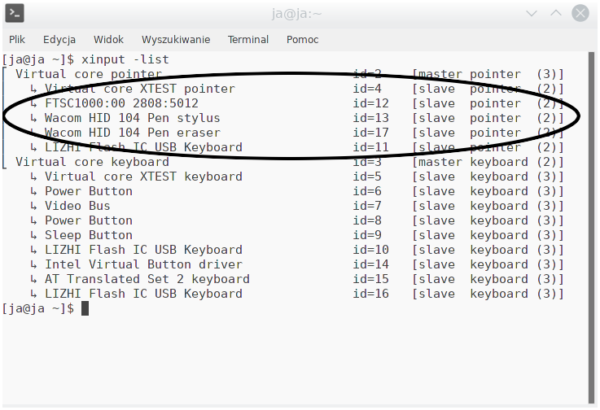

# palmrejection
Palm rejection script made for linux to improve wacom pen experience. Script disables touchscreen when wacom pen is near screen so that palm will not interfere with our wacom pen. Script was made for Cube mix plus but it might work with other touchscreen devices as well.

### **Requirements**

* xinput (Which is builtin in every(?) linux distribution)
* python2.7+

### **Configuration**

**Auto**

Run it with ```--auto``` argument for automatic configuration:

```python palmrejection.py --auto```

If it does not work, move to manual configuration

**Manual**

Type:
``` xinput -list ```
into terminal

You will see something like this



As you can see in the pictures above, there are few devices listed but we are only interested in those marked in ellipse.
```Wacom HID 104 Pen stylus/eraser``` is our wacom pen, and ```FTSC1000:00 2808:5012``` is our touchscreen. Devices names may vary depending on device, so yours devices might have more or less recognizable names. Usually wacom pen has in name wacom but touchscreen not necessarily. If you are not sure that you got proper touchscreen name type:

``` udevadm info --export-db | grep -B 7 "Name" ```

(Replace "Name" with your device name in quotes)

If you see ``` E: ID_INPUT_TOUCHSCREEN=1``` you got right device.

Now configuration part:

Open palmrejection.py in any text editor, at the beginning of script there are configuration variables.

```
# Configuration
touch_screen = ""
pen = ""
sleep_time_in_sec = 0.250
```

In touch_screen variable put your touchscreen device name which you got from ```xinput --list``` in quotes.

In pen variable put your wacom pen name which you got from ```xinput --list``` in quotes.

If your wacom pen has eraser and you want the script to also detect the eraser, you need to find common word in those two device names which is in my case ```Wacom HID 104 Pen``` but ```Wacom``` is enough.

```sleep_time_in_sec``` is sleep time between checks. The greater value reduces the check frequency. Try and choose experimentally the best value for you.

Configuration example
```
# Configuration
touch_screen = "FTSC1000:00 2808:5012"
pen = "Wacom"
sleep_time_in_sec = 0.250
```

To run type script ```python palmrejection.py```

You can add this script to startup so you will not have to launch it manually every time.

### **Warning**

If palmrejection script is force closed when wacom pen is near, there is possibility that touchscreen will be disabled. To re-enable find corresponding id to touchscreen name in ```xinput -list``` then
type  ```xinput enable id``` where 'id' is touchscreen id.

### **TODO**

* [x] Autoconfiguration (via udevadm?)

* [ ] Improve common name hack when pen has also eraser

### **License**

MIT License
